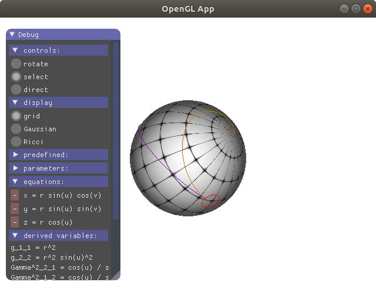
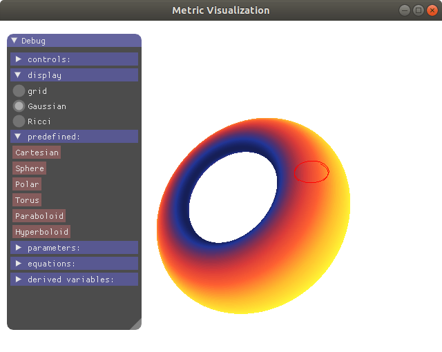
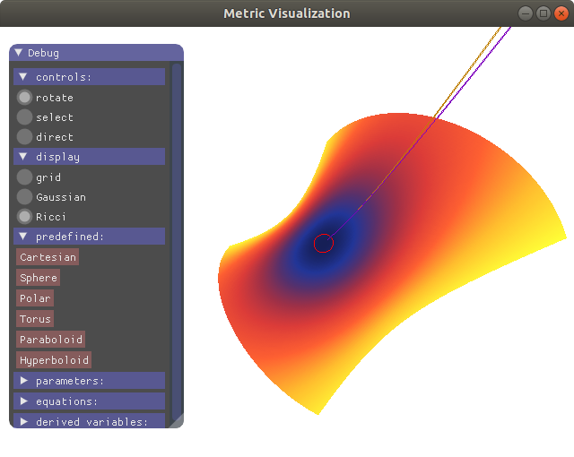
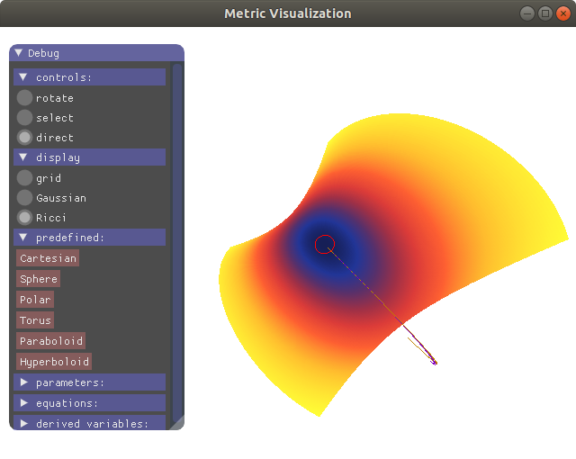

a Lua version (with ImGui) of the Javsacript version (based on Emscripten+Lua Symmath) of the Lua version (Symmath-based) of the metric visualization and diff geom calculation tool.
Javascript version is here http://christopheremoore.net/metric

TODO
- For Gaussian & Ricci curvatures: compile the equations to OpenCL, update the curvature values to a buffer, reduce to find min and max on that buffer (instead of searching for it via the CPU like I do now)
- Hide geodesics when showing Gaussian, Ricci, Riemann curvature.  Only show arrows in the selected directions for Ricci and Riemann curvatures.  Don't have a 'direction' picker for Gaussian curvature, and add a 2nd one for Riemann curvature. 

